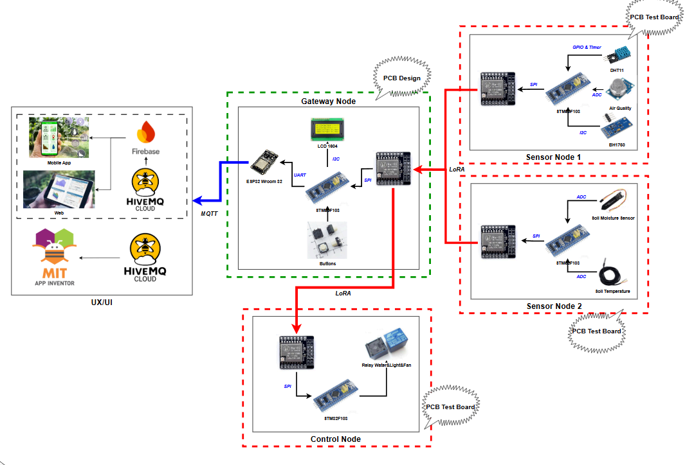
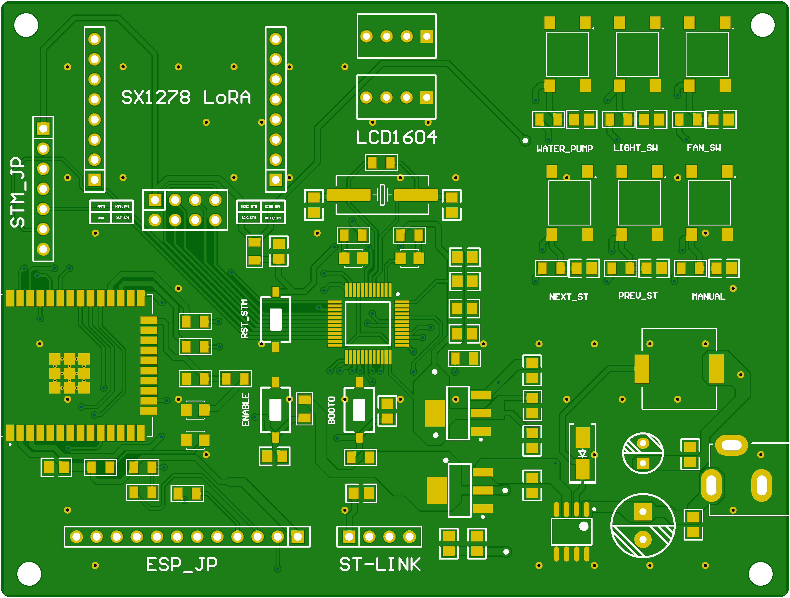
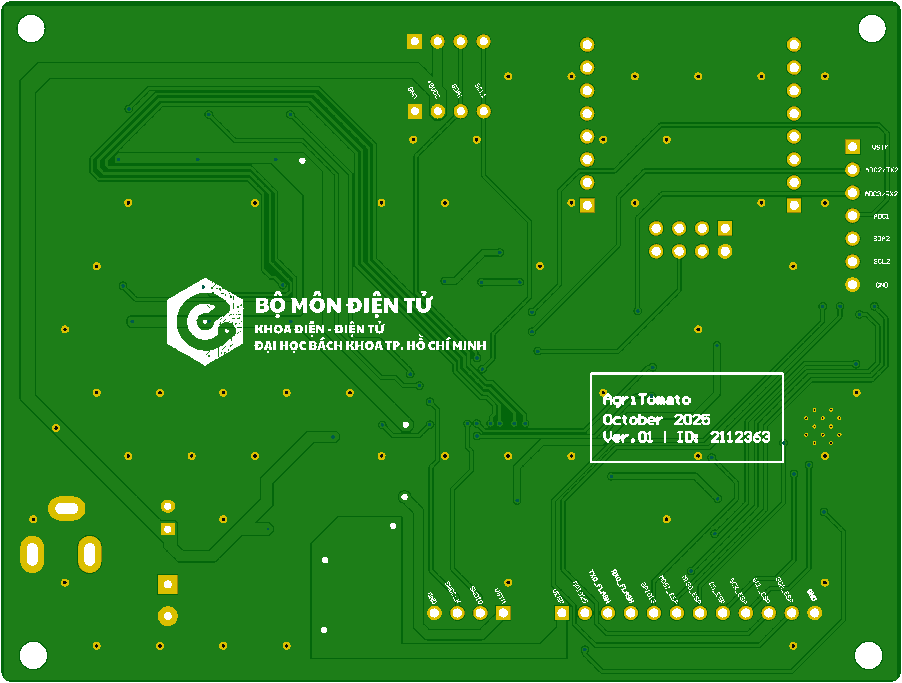
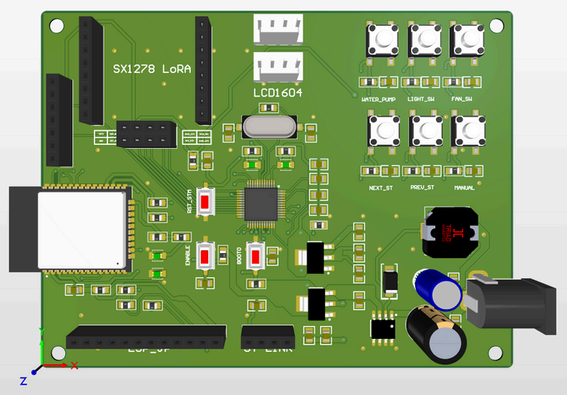
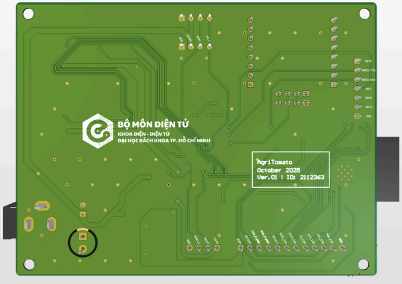
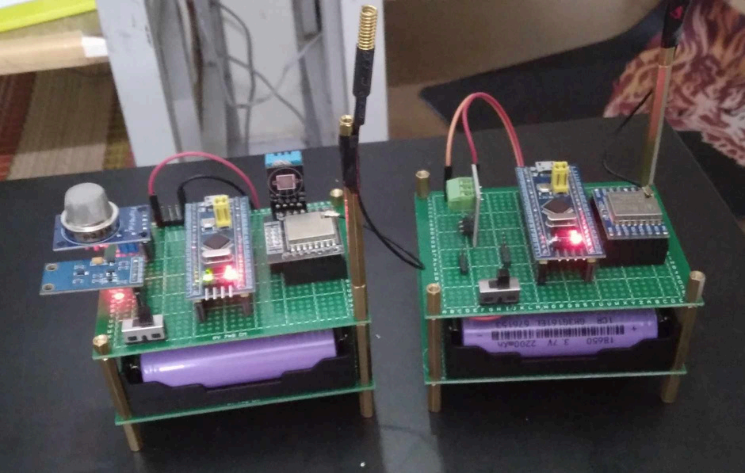
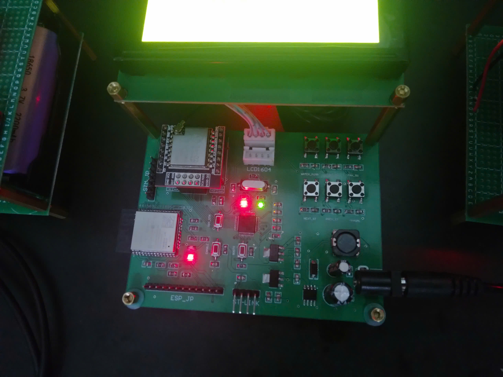
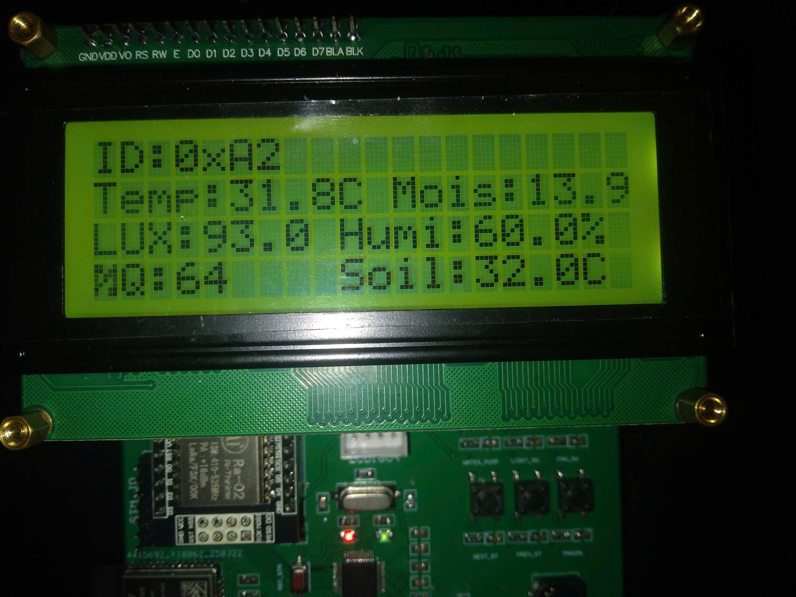

############# PROJECT DESCRIPTION #############
+ Target Customer: Small to medium-sized tomato farming households with cultivation areas ranging from 1 to 5 hectares, due to the limited communication range of LoRa technology when using a single gateway (no multi-hop, no LoRaWAN deployment). The number of sensor nodes is optimized to match the processing capabilities of microcontrollers instead of embedded computers or PLC systems.
+ Project Innovation: The project establishes a detailed care process tailored for each growth stage of the tomato plant; monitors battery capacity, optimizes energy consumption, and maximizes sensor node lifespan; ensures long-range, energy-efficient, and reliable communication using LoRa technology; and provides a user-friendly remote monitoring interface (UX/UI) integrated with an AI chatbot to assist users with plant-related queries.

------------------------------------------------------------------------------------------------------------------------------------------------------------------------------------------------------------------------------------------------

## 🌱 System Architecture & Communication Mechanism

In this project, **sensor nodes act as the master** in the communication process. This strategy is selected to avoid requiring the sensor nodes to stay awake continuously to receive commands from the gateway, which would lead to increased energy consumption and data delay, especially when the number of sensor nodes increases.

However, using sensor nodes as the master increases the risk of **data collision** when many nodes attempt to transmit at the same time. To solve this, a **Time Slot** method is applied.

### 🔁 Communication Flow:
- The **Gateway Node** always stays awake to receive data.
- Each **Sensor Node** is assigned a **specific time slot** during which it wakes up and transmits data.
- When not in their time slot, sensor nodes enter **sleep mode** to save power.
- Each transmission includes the node’s **unique ID** for identification.
- A Sensor Node:
  1. Wakes up at its time slot
  2. Listens to the channel
  3. If the channel is busy, it waits **100–200ms randomly** before sending
  4. Sends its data and waits for an **ACK** from the Gateway
  5. If no ACK is received, it retries after a **random delay**
## 🤖 Smart Decision with Fuzzy Logic
The system uses **Fuzzy Logic** to process sensor data and make care decisions for tomato crops. This logic is specifically designed for **three key growth stages**:
- Seedling stage
- Vegetative stage
- Fruiting stage
### ✅ Advantages of Fuzzy Logic:
- **Avoids energy waste** and switching noise from threshold-based systems.
- **More accurate and adaptive** to real-time data instead of binary on/off logic.
- **Improves reaction time** and system efficiency by removing the need to wait for the next sensor reading just to change the relay state.

------------------------------------------------------------------------------------------------------------------------------------------------------------------------------------------------------------------------------------------------

## 🌱 PCB AND PRODUCT HAVE DESIGNED

### ✅ Top-Layer:

### ✅ Bottom-Layer:

### ✅ 3D_View:

### ✅ Product:

